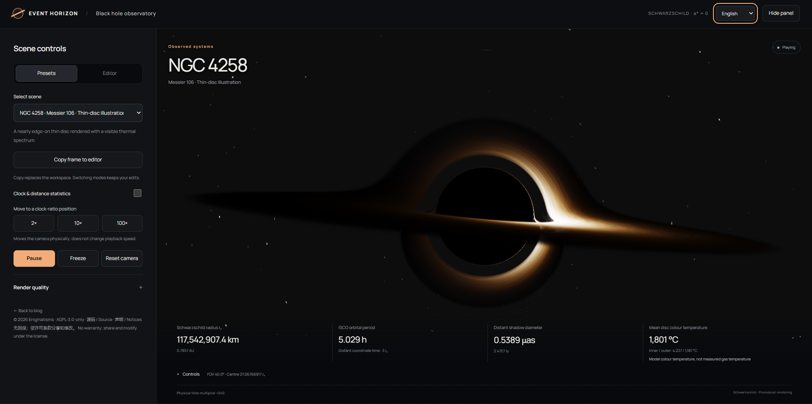
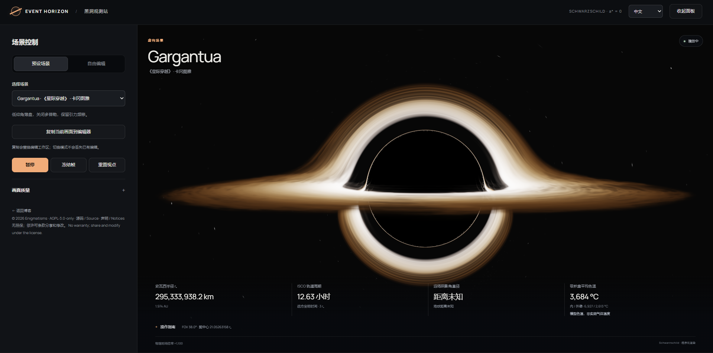

# Black Hole Museum

[English](./README.md)

一个可交互的 WebGL2 黑洞观测站。

可以选择策展场景，也可以切换到编辑器，自定义相机、吸积盘和颜色。网站完全运行在浏览器中。

## 截图





## 功能

- Schwarzschild 引力透镜
- 连续体积吸积盘
- 热黑体、艺术调色和幂律伪彩
- Doppler 频移与相对论束射控制
- 观测、虚构和艺术策展场景
- 可编辑相机、盘结构、密度、湍流、辐射、颜色、渐变、时间和星空
- 鼠标、触摸、键盘和 WASD 相机控制
- 视界距离、时间膨胀、计时和模型温度读数
- JSON 导入导出与本地工作区保存

## 模型

渲染器使用无自旋 Schwarzschild 时空。气体、光学密度、温度、颜色和场景形态是程序化参数，不是 Kerr、GRMHD、同步辐射或观测数据重建。

温度读数是热谱场景中的模型色温。伪彩场景不代表实测气体温度。

## 本地运行

使用任意静态 HTTP 服务器托管本目录即可。

```bash
python -m http.server 8000
```

然后打开 `http://127.0.0.1:8000/`。

## 许可证

观测站采用 **AGPL-3.0-only**。详见 [`LICENSE`](./LICENSE)、[`NOTICE`](./NOTICE) 和 [`source.html`](./source.html)。

第三方许可证位于 [`licenses/`](./licenses/)。
